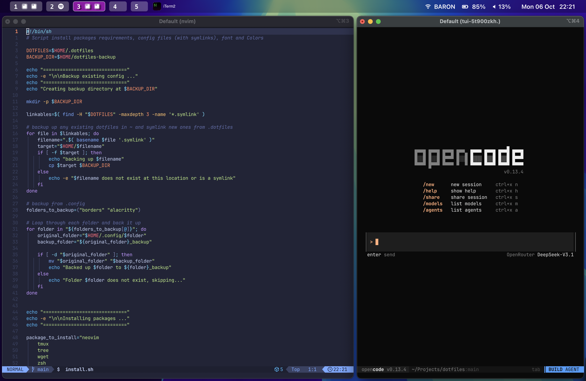

# dotfiles

This dotfiles repository provides a modern, productive, and visually appealing development environment for macOS. It brings together:

- [**aerospace**](https://github.com/nikitabobko/AeroSpace) an i3-like tiling window manager for macOS
- **Sketchybar** (macOS) for a highly customizable status bar, and **Aerospace** for advanced window management.
- **Zsh** as the main shell, with [Starship](https://starship.rs/) prompt using the [Pastel Powerline preset](https://starship.rs/presets/#pastel-powerline) for a fast, informative, and beautiful command line experience.
- **Tmux** for terminal multiplexing, session management, and efficient workflows.
- **Neovim & LazyVim** as a pre-configured, extensible Neovim setup for powerful code editing.
- **iTerm2** as the terminal emulator (macOS).
- **Hiddenbar** and **Stats** (macOS) for menu bar and system monitoring enhancements.
- Sensible defaults, backup and symlink management, and easy setup for new machines.


*Example: Starship prompt, iTerm2, and Sketchybar on macOS.*

## Getting Started

### Prerequisite
The install script backs up existing configuration files, but read below before running it!
Requirements:
* git
* [brew](https://brew.sh/) (on MacOS)

### Install
```
git clone https://github.com/rodrigobaron/dotfiles ~/.dotfiles
cd ~/.dotfiles
./install.sh         # Installs core tools, symlinks configs, sets up Ghostty & Starship, Hiddenbar, Stats, and LazyVim
./install_sketchybar.sh   # Installs Sketchybar and dependencies, sets up config
./install_aerospace.sh    # Installs Aerospace and sets up config
```

## What each install script does

### install.sh
- Installs required packages depending on OS (neovim, tmux, tree, wget, zsh, curl, starship, etc.)
- Symlinks tmux.conf, .zshrc, .zprofile, and other dotfiles
- Symlinks Starship config (Pastel Powerline preset) to ~/.config/starship.toml
- Installs Hiddenbar and Stats (MacOS)
- Installs LazyVim (clones https://github.com/LazyVim/starter to ~/.config/nvim, removes .git folder)
- Sets default shell to zsh

### install_sketchybar.sh
- Installs Sketchybar and its dependencies (sf-symbols, jq, gh)
- Downloads and installs the Sketchybar app font
- Backs up existing Sketchybar config and moves new config into place
- Restarts Sketchybar service

### install_aerospace.sh
- Installs Aerospace (MacOS window manager)
- Backs up existing Aerospace config and moves new config into place

## Tmux
command key remapped from ctrl+b to ctrl+a
Using theme from : https://github.com/gpakosz/.tmux

## Thanks

Thanks [Mehdi OUAZZA](https://github.com/mehd-io/dotfiles).
